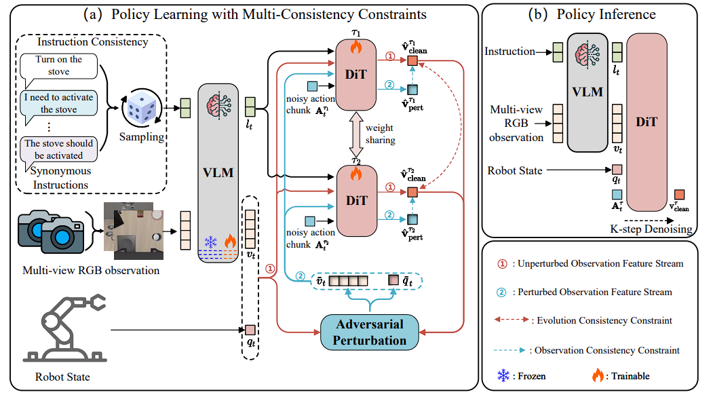

<p align="center">
  
</p>

<h1 align="center">RoVLA: Robust Vision-Language-Action Framework with Multi-Consistency Constraints</h1>

<p align="center">
  <a href="https://arxiv.org/abs/2605.19678"></a>
  <a href="https://github.com/HCPLab-SYSU/RoVLA"></a>
  <a href="https://pytorch.org/"></a>
  <a href="https://www.python.org/"></a>
</p>

<p align="center">
  <b>RoVLA</b> is a robust vision-language-action framework that enhances VLA model generalization and robustness through adversarial training and multi-consistency learning.
</p>

---

## 📋 Table of Contents

- [Overview](#-overview)
- [Key Features](#-key-features)
- [Project Structure](#-project-structure)
- [Installation](#-installation)
- [Quick Start](#-quick-start)
- [Training](#-training)
- [Evaluation](#-evaluation)
- [Results](#-results)
- [Acknowledgements](#-acknowledgements)
- [Citation](#-citation)
- [License](#-license)

---

## 🔍 Overview

RoVLA introduces **multi-consistency constraints** into vision-language-action (VLA) models to significantly improve their robustness and generalization capability in robotic manipulation tasks. Built upon NVIDIA's [GR00T N1.6](https://github.com/NVIDIA/Isaac-GR00T/tree/n1.6-release) framework with InternVL-3.5 backbone, RoVLA enforces consistency at three levels:

- **Instructional Consistency (IC)**: Ensures stable action grounding under semantically equivalent instruction rewrites.
- **Evolutionary Consistency (EC)**: Preserves coherent action intent throughout the flow matching generation process.
- **Observational Consistency (OC)**: Improves robustness to visual and proprioceptive perturbations via adversarial disturbances.

RoVLA is evaluated on the **LIBERO-Plus** and **RoboTwin 2.0** benchmarks and demonstrates state-of-the-art performance in robotic manipulation tasks.

---

## ✨ Core: Multi-Consistency Constraints

RoVLA introduces three complementary consistency constraints to enhance VLA robustness:

| Constraint | Description |
|------------|-------------|
| 🗣️ **Instructional Consistency (IC)** | Promotes stable grounding under semantically equivalent instruction rewrites, ensuring the model produces consistent actions across diverse phrasings of the same task |
| 🔄 **Evolutionary Consistency (EC)** | Preserves coherent action intent throughout the flow matching generation process by enforcing consistency across intermediate diffusion steps |
| 👁️ **Observational Consistency (OC)** | Improves robustness to visual and proprioceptive perturbations by enforcing consistent predictions before and after targeted disturbances (e.g., PGD adversarial attacks) |

---

## 📁 Project Structure

```
RoVLA/
├── gr00t/                           # Core implementation
│   ├── model/                       # Model definitions
│   │   ├── gr00t_n1d6/             # Base model architecture
│   │   └── modules/                # Model components
│   │       ├── pgd_module.py       # PGD adversarial training
│   │       ├── cslearning_module.py # Consistency learning
│   │       ├── dit.py              # Diffusion transformer
│   │       └── *_backbone.py       # VLM backbones (Eagle, InternVL, Qwen)
│   ├── experiment/                  # Training code
│   ├── eval/                        # Evaluation code
│   ├── configs/                     # Configuration files
│   └── data/                        # Data processing
├── scripts/                         # Utility scripts
│   └── lerobot_conversion/          # Dataset conversion tools
├── external_dependencies/           # External environments
├── examples/                        # Fine-tuning examples
│   ├── LIBERO/
│   ├── LIBEROPLUS/
│   ├── SO100/
│   └── robocasa/
├── media/                           # Images and diagrams
└── pyproject.toml                   # Project dependencies
```

---

## 🛠️ Installation

### Prerequisites

- Python 3.10
- PyTorch 2.6+
- CUDA-capable GPU (8x GPUs recommended for training)
- [uv](https://docs.astral.sh/uv/) package manager

### Step 1: Clone the Repository

```bash
git clone https://github.com/HCPLab-SYSU/RoVLA.git
cd RoVLA
```

### Step 2: Set Up the Environment

```bash
# Use the pre-configured pyproject.toml for Transformers 4.57
cp ./pyproject_transformers4.57.txt ./pyproject.toml

# Install dependencies with uv
pip install uv
uv sync --python 3.10

# Activate the virtual environment
source .venv/bin/activate

# Install the project in editable mode
uv pip install -e . \
    --extra-index-url https://pypi.tuna.tsinghua.edu.cn/simple \
    --extra-index-url https://pypi.nvidia.com/
```

### Step 3: Set Up LIBERO-Plus Environment

Follow the [LIBERO-Plus](https://github.com/sylvestf/LIBERO-plus) setup guide:

```bash
# Install LIBERO-Plus simulation environment
bash ./gr00t/eval/sim/LIBEROPLUS/setup_libero_plus.sh

# Download LIBERO-Plus assets
wget "https://huggingface.co/datasets/Sylvest/LIBERO-plus/resolve/main/assets.zip?download=true" -O ./assets.zip
mkdir -p ./temp/
unzip ./assets.zip -d ./temp/
mv ./temp/inspire/hdd/project/embodied-multimodality/public/syfei/libero_new/release/dataset/LIBERO-plus-0/assets \
   ./external_dependencies/LIBERO-plus/libero/libero/
rm -r ./temp/
rm ./assets.zip

# Download the LIBERO-Plus dataset from Hugging Face
huggingface-cli download \
    Sylvest/libero_plus_lerobot \
    --repo-type dataset \
    --local-dir $HOME/data/datasets/libero_plus_lerobot_4suite \
    --local-dir-use-symlinks False
```

---

## 🚀 Quick Start

### Instruction Coverage (IC) Diversification

Before training, generate diversified task instruction variants to improve language generalization:

```bash
python ./scripts/lerobot_conversion/generate_task_variants_ray.py \
    --task_path_pattern "$HOME/data/datasets/libero_plus_lerobot_4suite/lerobot/*/meta/tasks.jsonl"
```

---

## 🏋️ Training

Train RoVLA on the LIBERO-Plus benchmark with the following command:

```bash
export CUDA_VISIBLE_DEVICES=0,1,2,3,4,5,6,7
export NUM_GPUS=8

torchrun --nproc_per_node=$NUM_GPUS --standalone \
    gr00t/experiment/launch_finetune.py \
    --base_model_path ./gr00t/model/modules/GR00T-N1.6-InternVL3.5-3B \
    --dataset_path $HOME/data/datasets/libero_plus_lerobot_4suite/lerobot \
    --embodiment_tag LIBEROPLUS_PANDA \
    --num_gpus $NUM_GPUS \
    --output_dir $HOME/data/checkpoints/GR00TN-1.6-InterVL3.5-3B/liberoplus/rovla \
    --save_steps 5000 \
    --save_total_limit 5 \
    --max_steps 60000 \
    --warmup_ratio 0.05 \
    --weight_decay 1e-5 \
    --learning_rate 1e-4 \
    --global_batch_size 256 \
    --color_jitter_params brightness 0.3 contrast 0.4 saturation 0.5 hue 0.08 \
    --dataloader_num_workers 8 \
    --use_pgd \
    --use_consistency_learning \
    --deepspeed_stage 2 \
    --gradient_checkpointing
```

> **Note**: The `--use_pgd` and `--use_consistency_learning` flags enable the core multi-consistency constraints of RoVLA.

---

## 📊 Evaluation

Evaluation uses a **server-client** architecture. Start the server and client in separate terminals:

### Terminal 1: Start the Inference Server

```bash
export CUDA_VISIBLE_DEVICES=0,1,2,3
source .venv/bin/activate

./.venv/bin/python gr00t/eval/run_gr00t_server_multigpus.py \
    --model-path $HOME/data/checkpoints/GR00TN-1.6-InterVL3.5-3B/liberoplus/rovla/checkpoint-60000 \
    --embodiment-tag LIBEROPLUS_PANDA \
    --use-sim-policy-wrapper \
    --port 23782
```

### Terminal 2: Run the Evaluation Client

```bash
export CUDA_VISIBLE_DEVICES=0,1,2,3

gr00t/eval/sim/LIBEROPLUS/liberoplus_uv/.venv/bin/python \
    gr00t/eval/rollout_policy_multigpus.py \
    --n_episodes 1 \
    --policy_client_host 127.0.0.1 \
    --policy_client_port 23782 \
    --max_episode_steps=720 \
    --benchmark_name liberoplus/all \
    --n_action_steps 8 \
    --n_envs 1 \
    --use_spawn \
    --experinment_path $HOME/data/checkpoints/GR00TN-1.6-InterVL3.5-3B/liberoplus/rovla/checkpoint-60000
```

Evaluation results (success rates) will be saved to:
```
$HOME/data/checkpoints/GR00TN-1.6-InterVL3.5-3B/liberoplus/rovla/checkpoint-60000/eval_liberoplus/all/all_results.csv
```

---

## 🏆 Results

Please refer to our [paper](https://arxiv.org/abs/2605.19678) for detailed experimental results and analysis.

> **Note on RoboTwin 2.0**: Our paper also includes evaluation on the RoboTwin 2.0 benchmark. However, since RoboTwin's codebase relies heavily on hardcoded relative paths that require project-specific modifications, we are unable to provide directly executable evaluation scripts for it in this release. We recommend referring to the original [RoboTwin 2.0](https://github.com/RoboTwin-Platform/RoboTwin) repository and adapting the scripts to your local environment.

---

## 🙏 Acknowledgements

- This project is developed based on [NVIDIA GR00T N1.6](https://github.com/NVIDIA/Isaac-GR00T/tree/n1.6-release). We thank the NVIDIA GR00T team for their outstanding open-source contribution.
- We also thank the [LIBERO-Plus](https://github.com/sylvestf/LIBERO-plus) team and the [RoboTwin 2.0](https://github.com/RoboTwin-Platform/RoboTwin) team for providing the benchmarks and datasets.
- We thank [InternVL](https://github.com/OpenGVLab/InternVL) for providing the vision-language backbone.

---

## 📝 Citation

If you find RoVLA useful in your research, please consider citing:

```bibtex
@article{luo2026rovla,
  title={RoVLA: Multi-Consistency Constraints for Robust Vision-Language-Action Models},
  author={Luo, Jingzhou and Wen, Yifan and Bai, Yongjie and Song, Xinshuai and Liu, Yang and Lin, Liang},
  journal={arXiv preprint arXiv:2605.19678},
  year={2026}
}
```

---

## 📄 License

This project is released under the [MIT License](LICENSE).
